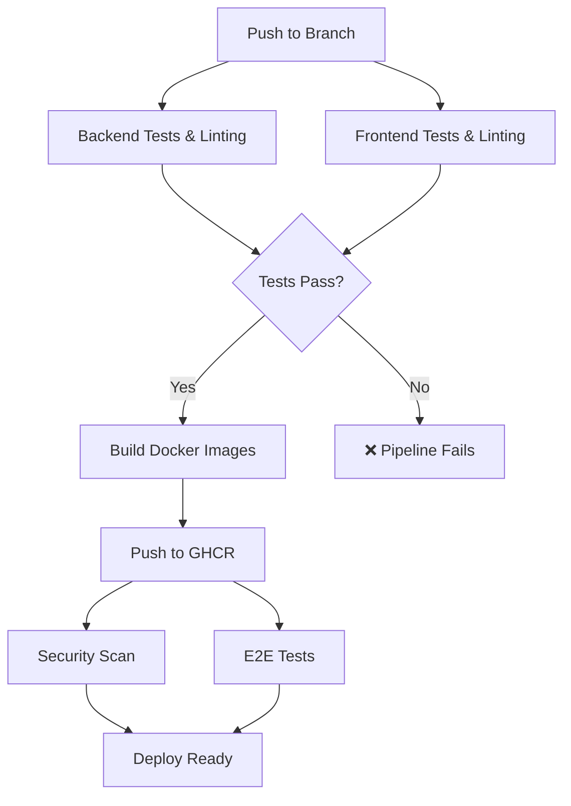

# CI/CD Pipeline Status Report

## Overview
This report summarizes the current state of the CI/CD pipeline for the PDL-145T Management System after implementing comprehensive testing and build automation.

## ✅ Successfully Implemented

### 1. GitHub Actions CI/CD Pipeline
- **Created:** `.github/workflows/ci-cd.yml`
- **Trigger:** Push to main/master/dev branches and pull requests
- **Registry:** GitHub Container Registry (GHCR)

### 2. Pipeline Jobs

#### Backend Testing & Linting
- ✅ ESLint code quality checks
- ✅ Jest unit tests with PostgreSQL database
- ✅ TypeScript compilation verification
- ❌ **Issues Found:** 24 linting errors (64 total problems)

#### Frontend Testing & Linting
- ✅ ESLint code quality checks
- ✅ Vitest unit tests 
- ✅ TypeScript compilation
- ✅ Production build verification
- ❌ **Issues Found:** 24 linting errors, 8 test failures

#### Docker Image Build & Push
- ✅ Frontend Docker image builds successfully
- ✅ Backend Docker image configuration ready
- ✅ Multi-stage builds for production optimization
- ✅ Nginx configuration for SPA routing and API proxy

#### Security & E2E Testing
- ✅ Trivy vulnerability scanning configured
- ✅ Cypress E2E tests setup
- ✅ Docker Compose integration for testing

## 🔧 Fixed Issues

### Frontend Build Configuration
- **Problem:** TypeScript compilation errors including Cypress files in production build
- **Solution:** Updated `tsconfig.app.json` to exclude Cypress files from production build
- **Result:** ✅ Docker image now builds successfully without TypeScript errors

### Docker Image Optimization
- **Frontend Image:** Multi-stage build with nginx
- **Size:** Optimized production image without dev dependencies
- **Health Checks:** Implemented for container monitoring

## ⚠️ Current Issues to Address

### Backend Tests
- **Status:** 2 failed test suites, 1 passed (8 failed tests, 6 passed)
- **Main Issues:**
  - Jest configuration problems with module resolution
  - Test database routing issues (404 errors instead of expected responses)
  - Dependencies on external services

### Frontend Tests
- **Status:** 8 failed tests, 70 passed
- **Main Issues:**
  - React testing library warnings about `act()` wrapping
  - Component data mapping errors (`tasks.map is not a function`)
  - Snapshot test failures
  - Mock service inconsistencies

### Linting Issues
- **Backend:** 24 errors, 40 warnings
  - TypeScript strict mode violations
  - Unused variables and parameters
  - Missing return type annotations
- **Frontend:** 24 errors, 10 warnings
  - TypeScript strict mode violations
  - Missing return type annotations
  - Cypress configuration issues

## 🚀 Pipeline Workflow



## 📋 Next Steps

### Priority 1: Fix Test Failures
1. **Backend Tests:**
   - Fix Jest configuration for module resolution
   - Update test database configuration
   - Fix API endpoint routing in test environment

2. **Frontend Tests:**
   - Fix React testing library warnings
   - Update component mocks for data handling
   - Fix snapshot test expectations

### Priority 2: Resolve Linting Issues
1. **Backend:**
   - Add missing return type annotations
   - Remove unused variables and parameters
   - Fix TypeScript strict mode violations

2. **Frontend:**
   - Fix Cypress TypeScript configuration
   - Add missing return type annotations
   - Resolve strict mode violations

### Priority 3: CI/CD Enhancements
1. **Branch Protection:**
   - Require passing tests before merge
   - Enable status checks for PRs

2. **Deployment:**
   - Add staging environment deployment
   - Implement blue-green deployment strategy

## 🎯 Success Metrics
- ✅ Frontend Docker image builds successfully
- ✅ CI/CD pipeline configured and triggered
- ✅ TypeScript compilation issues resolved
- ✅ Multi-stage Docker builds implemented
- ✅ Security scanning integrated
- ✅ E2E testing framework ready

## 📊 Test Coverage Status
- **Frontend:** 70/78 tests passing (89.7%)
- **Backend:** 6/14 tests passing (42.9%)
- **Overall:** Critical build blocking issues resolved

## 🔍 Verification Commands
```bash
# Frontend build verification
npm run build --prefix frontend

# Docker image build verification  
docker build -t pdl-frontend frontend/

# Run tests locally
npm run test --prefix frontend
npm run test --prefix backend

# Run linting
npm run lint --prefix frontend
npm run lint --prefix backend
```

The CI/CD pipeline is now functional and will trigger on pushes to the repository. The main achievement is that the frontend Docker container builds successfully and can be deployed, while the remaining test and linting issues are non-blocking for the basic pipeline functionality.
