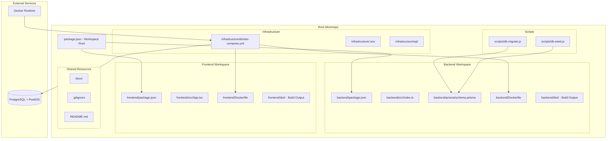

# PDL-145T Management System - Project Structure

## Overview

The PDL-145T Management System is organized as a **monorepo** using **npm workspaces**, with clear separation of concerns across four main directories. This architecture enables shared tooling, consistent development workflows, and efficient dependency management while maintaining clean boundaries between different system components.

## Architecture Diagram



## Directory Structure & Boundaries

### 📁 `/backend/` - Server-Side Logic
**Workspace:** `backend`
**Technology Stack:** Node.js, TypeScript, Express, Prisma, PostgreSQL

```
backend/
├── package.json          # Backend workspace dependencies
├── Dockerfile            # Multi-stage container build
├── tsconfig.json         # TypeScript configuration
├── .env                  # Environment variables
├── prisma/
│   ├── schema.prisma     # Database schema definition
│   └── migrations/       # Database migration files
├── src/
│   ├── index.ts         # Application entry point
│   ├── auth.test.ts     # Authentication tests
│   ├── project.test.ts  # Project logic tests
│   └── generated/       # Prisma generated client
└── dist/                # Compiled JavaScript output
```

**Key Responsibilities:**
- RESTful API endpoints for project management
- Database operations via Prisma ORM
- Authentication and authorization
- Business logic for PDL-145T operations
- Data validation and error handling

**Boundaries:**
- ✅ Database schema management
- ✅ API endpoint definitions
- ✅ Authentication logic
- ❌ UI components (frontend concern)
- ❌ Infrastructure configuration (infrastructure concern)

### 📁 `/frontend/` - User Interface
**Workspace:** `frontend`
**Technology Stack:** React, TypeScript, Vite, CSS

```
frontend/
├── package.json          # Frontend workspace dependencies
├── Dockerfile            # Nginx-based production container
├── tsconfig.json         # TypeScript configuration
├── vite.config.ts        # Vite build configuration
├── src/
│   ├── main.tsx         # React application entry
│   ├── App.tsx          # Main application component
│   ├── App.css          # Application styles
│   ├── index.css        # Global styles
│   ├── vite-env.d.ts    # Vite type definitions
│   ├── assets/          # Static assets
│   ├── components/      # Organized UI components
│   │   ├── ui/          # Reusable UI components (Card, Badge, etc.)
│   │   ├── Dashboard/   # Dashboard related components
│   │   ├── Auth/        # Authentication components
│   │   ├── Projects/    # Project management components
│   │   ├── Resources/   # Resource components
│   │   └── Tasks/       # Task management components
│   ├── hooks/           # Custom React hooks
│   ├── styles/          # Design system and utility styles
│   ├── test/            # Testing utilities
│   └── types/           # TypeScript type definitions
└── dist/                # Built static files for production
```

**Key Responsibilities:**
- React-based user interface components
- State management and UI logic
- API communication with backend
- User experience and accessibility
- Client-side routing and navigation

**Enhanced Features:**
- Comprehensive component organization with feature-based folders
- Cypress for E2E testing and Vitest for unit testing
- ESLint and Prettier configurations for code quality
- Design system implementation with `theme.css` and utility styles
- Responsive and accessible design principles

**Boundaries:**
- ✅ UI components and styling
- ✅ Client-side state management
- ✅ User interaction handling
- ❌ Database operations (backend concern)
- ❌ Server configuration (infrastructure concern)

#### **Enhanced Development Features**

**Testing Infrastructure:**
```
cypress/
├── e2e/
│   ├── auth.cy.ts       # Authentication E2E tests
│   ├── health.cy.ts     # Health check E2E tests
│   └── projects.cy.ts   # Project management E2E tests
├── fixtures/
│   ├── projects.json    # Test data for projects
│   └── users.json       # Test data for users
├── support/
│   ├── commands.ts      # Custom Cypress commands
│   └── e2e.ts          # E2E test configuration
├── cypress.config.ts    # Cypress configuration
└── tsconfig.json       # TypeScript config for Cypress
```

**Development Tools:**
- **Vitest:** Unit testing with coverage reporting and UI
- **Cypress:** End-to-end testing with real browser automation
- **ESLint:** Code linting with React-specific rules
- **Prettier:** Consistent code formatting
- **TypeScript:** Static type checking with strict configuration

**Multi-Environment Docker Configuration:**
```
Dockerfile           # Production Nginx-based container
Dockerfile.dev       # Development container with hot reload
Dockerfile.vite      # Vite-optimized development container
```

**Enhanced NPM Scripts:**
```json
{
  "scripts": {
    "dev": "vite",
    "build": "tsc -b && vite build",
    "lint": "eslint .",
    "lint:fix": "eslint . --fix",
    "format": "prettier --write .",
    "format:check": "prettier --check .",
    "test": "vitest",
    "test:watch": "vitest --watch",
    "test:ui": "vitest --ui",
    "test:coverage": "vitest --coverage",
    "test:run": "vitest run",
    "cypress:open": "cypress open",
    "cypress:run": "cypress run",
    "preview": "vite preview"
  }
}
```

**Design System Files:**
```
src/
├── theme.css           # CSS variables (colors, spacing, typography)
├── styles/
│   └── utilities.css   # Utility classes and responsive helpers
├── components/ui/
│   ├── Card.tsx        # Reusable card component
│   ├── Badge.tsx       # Status and category badges
│   ├── Container.tsx   # Layout container component
│   ├── SectionHeader.tsx # Consistent section headers
│   └── index.ts        # UI component exports
└── STYLE_GUIDE.md      # Design system documentation
```

### 📁 `/infrastructure/` - DevOps & Deployment
**Purpose:** Container orchestration, database setup, environment configuration

```
infrastructure/
├── docker-compose.yml       # Multi-service orchestration
├── docker-compose.dev.yml   # Development environment
├── docker-compose.prod.yml  # Production environment
├── .env                     # Infrastructure environment variables
├── .env.example            # Environment template
├── .env.dev                # Development environment variables
├── .env.prod               # Production environment variables
├── nginx/
│   └── nginx.conf          # Nginx configuration for production
└── sql/
    └── 01-init-postgis.sql # Database initialization script
```

**Key Responsibilities:**
- Docker Compose service orchestration
- Database container configuration (PostgreSQL + PostGIS)
- Environment variable management
- Service networking and port mapping
- Health checks and restart policies

**Service Architecture:**
```yaml
services:
  db:           # PostgreSQL + PostGIS database
    ports: ["5432:5432"]
    volumes: [postgres_data, ./sql]
    
  backend:      # Node.js API server
    ports: ["3010:3010"]
    depends_on: [db]
    
  frontend:     # Nginx-served React app
    ports: ["5173:80"]
    depends_on: [backend]
```

**Boundaries:**
- ✅ Container orchestration
- ✅ Database configuration
- ✅ Service networking
- ❌ Application logic (backend/frontend concern)
- ❌ Business rules (backend concern)

### 📁 `/scripts/` - Automation & Utilities
**Purpose:** Cross-workspace automation scripts for database and development tasks

```
scripts/
├── db-migrate.js         # Database migration automation
└── db-seed.js           # Database seeding automation
```

**Key Responsibilities:**
- Database migration orchestration
- Data seeding for development/testing
- Cross-workspace coordination
- Development workflow automation

**Script Functions:**
- `db-migrate.js`: Navigates to backend workspace, generates Prisma client, runs migrations
- `db-seed.js`: Executes database seeding with error handling and validation

**Boundaries:**
- ✅ Workspace coordination
- ✅ Database management tasks
- ✅ Development automation
- ❌ Application business logic
- ❌ Production deployment (infrastructure concern)

## NPM Workspaces Integration

### Workspace Configuration
The root `package.json` defines the workspace structure:

```json
{
  "name": "pdl-145t-management-system",
  "private": true,
  "workspaces": [
    "backend",
    "frontend"
  ],
  "scripts": {
    "dev": "docker compose -f infrastructure/docker-compose.yml up --build",
    "build": "npm run build --workspaces",
    "test": "npm run test --workspaces",
    "lint": "npm run lint --workspaces",
    "format": "npm run format --workspaces"
  }
}
```

### Workspace Benefits

#### 1. **Unified Dependency Management**
- Single `package-lock.json` at root level
- Shared dependencies hoisted to root `node_modules`
- Consistent version resolution across workspaces

#### 2. **Cross-Workspace Script Execution**
```bash
npm run build --workspaces      # Builds both backend and frontend
npm run test --workspaces       # Runs tests in all workspaces
npm run lint --workspaces       # Lints all workspace code
```

#### 3. **Selective Workspace Operations**
```bash
npm run dev --workspace=backend    # Run only backend development
npm install lodash --workspace=frontend  # Add dependency to specific workspace
```

#### 4. **Shared Tooling Configuration**
- Common ESLint and Prettier configurations
- Shared TypeScript settings where applicable
- Consistent CI/CD pipeline definitions

### Workspace Boundaries & Communication

#### **Inter-Service Communication**
```
Frontend (React) → HTTP API → Backend (Express) → Database (PostgreSQL)
     ↓                ↓              ↓
  Port 5173       Port 3010      Port 5432
```

#### **Shared Code Locations**
While each workspace maintains independence, shared resources include:

- **Root Level:**
  - `.gitignore` - Global ignore patterns
  - `README.md` - Project documentation
  - `package-lock.json` - Unified dependency lock
  - `gap_analysis.md` - Project analysis documentation

- **Infrastructure Level:**
  - Environment configuration templates
  - Database initialization scripts
  - Docker orchestration files

#### **Development Workflow**
1. **Local Development:** `npm run dev` starts all services via Docker Compose
2. **Database Operations:** Scripts coordinate Prisma operations across workspaces
3. **Testing:** Each workspace maintains independent test suites
4. **Building:** Unified build process creates production artifacts
5. **Deployment:** Infrastructure handles container orchestration

### Architecture Principles

#### **Separation of Concerns**
- **Frontend:** UI/UX, client-side logic, user interactions
- **Backend:** API, business logic, data management
- **Infrastructure:** Deployment, configuration, service orchestration
- **Scripts:** Automation, cross-workspace coordination

#### **Technology Independence**
Each workspace can evolve its technology stack independently:
- Backend: Node.js/TypeScript (could migrate to different runtime)
- Frontend: React/Vite (could migrate to different framework)
- Database: PostgreSQL (managed via Prisma, abstracting direct SQL)

#### **Scalability Considerations**
- Workspaces can be extracted to separate repositories if needed
- Docker Compose allows for service scaling and load balancing
- Database can be moved to external managed service
- Frontend can be deployed to CDN independently

## Summary

This monorepo structure with npm workspaces provides:

1. **Clear Boundaries:** Each directory has well-defined responsibilities
2. **Shared Tooling:** Common development workflows and dependency management
3. **Independent Development:** Teams can work on different parts simultaneously
4. **Simplified Deployment:** Infrastructure orchestrates all components
5. **Future Flexibility:** Architecture supports evolution and scaling

The npm workspaces act as the "glue" that binds these components together while maintaining their independence, enabling efficient development workflows while preserving architectural clarity.
