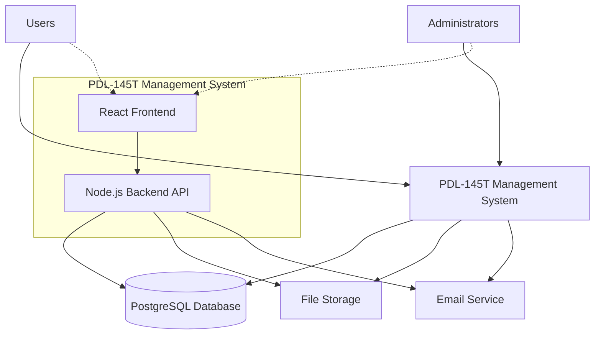

# Architecture Documentation

## C4 Context Diagram



### System Context

The PDL-145T Management System is a comprehensive web application designed to manage PDL-145T operations. It consists of:

- **React Frontend**: User interface for end users and administrators
- **Node.js Backend API**: REST API server handling business logic
- **PostgreSQL Database**: Primary data storage with PostGIS extensions
- **Docker Infrastructure**: Containerized deployment and development environment

### Key Components

1. **Frontend Application (React)**
   - Modern React application with TypeScript
   - Responsive design for desktop and mobile
   - Real-time updates and notifications
   - User authentication and authorization

2. **Backend API (Node.js/Express)**
   - RESTful API endpoints
   - Authentication and authorization middleware
   - Business logic implementation
   - Database integration with Prisma ORM

3. **Database (PostgreSQL)**
   - Structured data storage
   - PostGIS extensions for spatial data
   - Prisma schema management
   - Migration and seeding capabilities

4. **Infrastructure (Docker)**
   - Containerized services
   - Development environment setup
   - Production deployment configuration
   - Service orchestration with Docker Compose

### External Dependencies

- **File Storage**: External file storage service for document management
- **Email Service**: Email notification system for user communications
- **Authentication Provider**: External authentication service (if applicable)

### Technology Stack

- **Frontend**: React, TypeScript, Vite
- **Backend**: Node.js, Express, TypeScript
- **Database**: PostgreSQL with PostGIS
- **ORM**: Prisma
- **Containerization**: Docker, Docker Compose
- **Testing**: Jest, React Testing Library
- **Code Quality**: ESLint, Prettier

## Architecture Decisions

### ADR-001: Technology Stack Selection
- **Status**: Accepted
- **Decision**: Use Node.js/React/PostgreSQL stack
- **Rationale**: Provides full-stack JavaScript development, strong ecosystem, and robust database capabilities

### ADR-002: Containerization Strategy
- **Status**: Accepted
- **Decision**: Use Docker for development and deployment
- **Rationale**: Ensures consistent environments across development, testing, and production

### ADR-003: Database Choice
- **Status**: Accepted
- **Decision**: PostgreSQL with PostGIS extensions
- **Rationale**: Provides strong relational database capabilities with spatial data support


Suggestion for normalized database schema that can be used to store and retrieve data from multiple entities like Projects, Tasks, Expenses, etc. This schema is designed with relational integrity in mind, ensuring that each entity has its own table, and relationships are properly defined.

### Database Schema Overview

1. **Projects Table**
   - Manages the overall projects.
   
2. **Tasks Table**
   - Manages individual tasks within a project.

3. **Expenses Table**
   - Tracks expenses associated with tasks or projects.

4. **Resources Table**
   - Stores information about available resources for project execution.

5. **Measurements Table**
   - Records site measurements performed by the Construction Execution Agent.

6. **Validations Table**
   - Tracks validations of construction sites by the Construction Execution Agent.

7. **Reports Table**
   - Holds reports generated for billing validation by the Finance and Logistics Agent.

### SQL Schema

```sql
-- Projects Table
CREATE TABLE Projects (
    ProjectID INT PRIMARY KEY AUTO_INCREMENT,
    Name VARCHAR(255) NOT NULL,
    StartDate DATE NOT NULL,
    EndDate DATE,
    TotalBudget DECIMAL(10, 2) NOT NULL
);

-- Tasks Table
CREATE TABLE Tasks (
    TaskID INT PRIMARY KEY AUTO_INCREMENT,
    ProjectID INT,
    Description TEXT,
    Duration INT,
    AssignedTo VARCHAR(100),
    CompletionStatus ENUM('Not Started', 'In Progress', 'Completed'),
    FOREIGN KEY (ProjectID) REFERENCES Projects(ProjectID)
);

-- Expenses Table
CREATE TABLE Expenses (
    ExpenseID INT PRIMARY KEY AUTO_INCREMENT,
    TaskID INT,
    Description TEXT,
    Cost DECIMAL(10, 2),
    Date DATE,
    FOREIGN KEY (TaskID) REFERENCES Tasks(TaskID)
);

-- Resources Table
CREATE TABLE Resources (
    ResourceID INT PRIMARY KEY AUTO_INCREMENT,
    Type VARCHAR(100),
    Quantity DECIMAL(10, 2)
);

-- Project Resources Table (Many-to-Many Relationship)
CREATE TABLE ProjectResources (
    ProjectID INT,
    ResourceID INT,
    PRIMARY KEY (ProjectID, ResourceID),
    FOREIGN KEY (ProjectID) REFERENCES Projects(ProjectID),
    FOREIGN KEY (ResourceID) REFERENCES Resources(ResourceID)
);

-- Tasks Resources Table (Many-to-Many Relationship)
CREATE TABLE TaskResources (
    TaskID INT,
    ResourceID INT,
    PRIMARY KEY (TaskID, ResourceID),
    FOREIGN KEY (TaskID) REFERENCES Tasks(TaskID),
    FOREIGN KEY (ResourceID) REFERENCES Resources(ResourceID)
);

-- Measurements Table
CREATE TABLE Measurements (
    MeasurementID INT PRIMARY KEY AUTO_INCREMENT,
    TaskID INT,
    SiteID VARCHAR(100),
    MeasurementType VARCHAR(100),
    Value DECIMAL(10, 2),
    Date DATE,
    FOREIGN KEY (TaskID) REFERENCES Tasks(TaskID)
);

-- Validations Table
CREATE TABLE Validations (
    ValidationID INT PRIMARY KEY AUTO_INCREMENT,
    TaskID INT,
    SiteID VARCHAR(100),
    Status ENUM('Pending', 'Approved', 'Rejected'),
    Notes TEXT,
    GeneratedBy VARCHAR(100),
    Timestamp TIMESTAMP DEFAULT CURRENT_TIMESTAMP,
    FOREIGN KEY (TaskID) REFERENCES Tasks(TaskID)
);

-- Reports Table
CREATE TABLE Reports (
    ReportID INT PRIMARY KEY AUTO_INCREMENT,
    ValidationID INT,
    GeneratedBy VARCHAR(100),
    Timestamp TIMESTAMP DEFAULT CURRENT_TIMESTAMP,
    FOREIGN KEY (ValidationID) REFERENCES Validations(ValidationID)
);
```

### Explanation of Tables and Relationships

1. **Projects**: Manages the overall projects, including their start date, end date, and total budget.
2. **Tasks**: Stores tasks within a project, linked to a specific project via `ProjectID`.
3. **Expenses**: Tracks expenses associated with each task, linked to a specific task via `TaskID`.
4. **Resources**: Stores available resources that can be allocated to projects or tasks.
5. **ProjectResources and TaskResources**: Many-to-many relationships between Projects and Resources, as well as Tasks and Resources, allowing flexibility in resource allocation.
6. **Measurements**: Records site measurements performed by the Construction Execution Agent, linked to a specific task via `TaskID`.
7. **Validations**: Tracks validations of construction sites by the Construction Execution Agent, linked to a specific task via `TaskID`.
8. **Reports**: Holds reports generated for billing validation by the Finance and Logistics Agent, linked to a specific validation via `ValidationID`.

### Benefits of This Schema

- **Normalization**: Ensures data integrity and minimizes redundancy.
- **Flexibility**: Allows for easy addition of new entities or attributes without breaking existing relationships.
- **Scalability**: Suitable for growing projects with increasing tasks, expenses, and resources.

This schema can be further customized based on specific requirements, such as adding more detailed fields, additional tables, or complex queries to support advanced reporting and analysis.

## Future Considerations

- Microservices architecture for horizontal scaling
- API gateway implementation
- Event-driven architecture for real-time features
- Caching layer implementation
- Content delivery network (CDN) integration

# Tool Library for the application:

### 1. **Gantt Charts**
- **Highcharts**: A widely used JavaScript library for creating high-performance charts and graphs, including Gantt charts.
  - Website: [https://www.highcharts.com/gantt/](https://www.highcharts.com/gantt/)
  - Example:
    ```javascript
    Highcharts.ganttChart('container', {
        series: [{
            name: 'Project milestones',
            data: [
                { name: 'Task #1', start: Date.UTC(2023, 5, 1), end: Date.UTC(2023, 5, 5) },
                { name: 'Task #2', start: Date.UTC(2023, 5, 6), end: Date.UTC(2023, 5, 10) }
            ]
        }]
    });
    ```

- **FullCalendar**: A JavaScript library that renders calendar views (like Gantt charts) and provides a flexible interface for event management.
  - Website: [https://fullcalendar.io/](https://fullcalendar.io/)
  - Example:
    ```javascript
    document.addEventListener('DOMContentLoaded', function() {
        var calendarEl = document.getElementById('calendar');
        var calendar = new FullCalendar.Calendar(calendarEl, {
            initialView: 'timeline',
            timeZone: 'UTC',
            events: [
                { title: 'Task #1', start: '2023-06-01T08:00:00Z', end: '2023-06-05T17:00:00Z' },
                { title: 'Task #2', start: '2023-06-06T09:00:00Z', end: '2023-06-10T18:00:00Z' }
            ]
        });
        calendar.render();
    });
    ```

### 2. **Heatmaps**
- **Leaflet Heatmap Plugin**: A plugin for Leaflet.js that allows you to create heatmaps on maps, useful for visualizing density data.
  - Website: [https://leaflet.github.io/heatmaps/](https://leaflet.github.io/heatmaps/)
  - Example:
    ```javascript
    var map = L.map('map').setView([51.505, -0.09], 13);
    L.tileLayer('https://{s}.tile.openstreetmap.org/{z}/{x}/{y}.png', {
        attribution: '© OpenStreetMap contributors'
    }).addTo(map);

    var heatmapData = [[51.5, -0.09, 0.8], [51.49, -0.06, 0.6]];
    L.heatLayer(heatmapData).addTo(map);
    ```

- **D3.js**: A powerful library for creating interactive data visualizations.
  - Website: [https://d3js.org/](https://d3js.org/)
  - Example:
    ```javascript
    d3.select("body").append("svg")
        .attr("width", width)
        .attr("height", height)
      .selectAll("circle")
        .data(heatmapData)
      .enter().append("circle")
        .attr("cx", function(d) { return x(d[0]); })
        .attr("cy", function(d) { return y(d[1]); })
        .attr("r", function(d) { return Math.sqrt(d[2]) * 5; });
    ```

### 3. **Timelines**
- **D3.js**: As mentioned earlier, D3.js is excellent for creating complex and interactive timelines.
  - Website: [https://d3js.org/](https://d3js.org/)
  - Example:
    ```javascript
    d3.select("body").append("svg")
        .attr("width", width)
        .attr("height", height)
      .selectAll("rect")
        .data(timelineData)
      .enter().append("rect")
        .attr("x", function(d) { return x(d.start); })
        .attr("y", function(d, i) { return y(i); })
        .attr("width", function(d) { return x(d.end) - x(d.start); })
        .attr("height", height / timelineData.length)
        .style("fill", "steelblue");
    ```

- **TimelineJS**: A tool for creating engaging timelines with multimedia content.
  - Website: [https://timeline.knightlab.com/](https://timeline.knightlab.com/)
  - Example:
    ```html
    <script src="https://cdn.knightlab.com/libs/timeline3/latest/js/timeline-min.js"></script>
    <div id="timeline-embed"></div>
    <script type="text/javascript">
      var data = {
        "events": [
          { "start_date" : { "year" : 2010 }, "end_date" : { "year" : 2011 }, "text" : { "headline" : "Event 1", "text" : "Description of Event 1." }},
          { "start_date" : { "year" : 2012 }, "end_date" : { "year" : 2013 }, "text" : { "headline" : "Event 2", "text" : "Description of Event 2." }}
        ]
      };
      var timeline = new TL.Timeline('timeline-embed', data);
    </script>
    ```

These tools and libraries provide a robust foundation for creating interactive reports. Depending on your specific requirements, you might need to combine multiple tools or customize them further to achieve the desired visualizations.

To implement the mentioned requirements in a microservices architecture, follow these steps:

### 1. **Microservices Architecture for Horizontal Scaling**
#### Define Services
Start by defining your services based on bounded contexts and business capabilities. For example:
- User Management Service
- Order Processing Service
- Payment Gateway Service

#### Use Containerization (Docker)
Containerize each service to ensure they are portable and isolated from the environment.

```dockerfile
# Example Dockerfile for a user management service
FROM node:14
WORKDIR /app
COPY package*.json ./
RUN npm install
COPY . .
CMD ["node", "server.js"]
```

#### Use Orchestration (Kubernetes)
Set up Kubernetes to manage your containerized services. This will enable you to scale horizontally by adding more replicas of each service.

```yaml
# Example Kubernetes deployment for a user management service
apiVersion: apps/v1
kind: Deployment
metadata:
  name: user-management-service
spec:
  replicas: 3
  selector:
    matchLabels:
      app: user-management
  template:
    metadata:
      labels:
        app: user-management
    spec:
      containers:
      - name: user-management
        image: your-docker-registry/user-management-service:latest
        ports:
        - containerPort: 3000
```

### 2. **API Gateway Implementation**
#### Use an API Gateway (e.g., AWS API Gateway, NGINX)
The API gateway acts as a single entry point for clients to access multiple microservices.

**Using AWS API Gateway:**
- Create a REST API.
- Define methods (GET, POST, PUT, DELETE) and routes that map to your microservices.

**Using NGINX:**
- Configure NGINX as an reverse proxy.
- Use routing rules based on the request path to direct traffic to appropriate services.

```nginx
http {
    upstream user_management_service {
        server user-management-service:3000;
    }
    upstream order_processing_service {
        server order-processing-service:3000;
    }

    server {
        listen 80;

        location /user {
            proxy_pass http://user_management_service;
        }

        location /order {
            proxy_pass http://order_processing_service;
        }
    }
}
```

### 3. **Event-Driven Architecture for Real-Time Features**
#### Use an Event Bus (e.g., AWS EventBridge, Kafka)
An event bus facilitates communication between microservices by publishing and subscribing to events.

**Using AWS EventBridge:**
- Create custom events.
- Configure rules that trigger the appropriate services based on events.

**Using Apache Kafka:**
- Set up a Kafka cluster.
- Produce events from one service.
- Consume events in another service.

```java
// Example using AWS SDK for Java
import software.amazon.awssdk.services.eventbridge.EventBridgeClient;
import software.amazon.awssdk.services.eventbridge.model.PutEventsRequest;
import software.amazon.awssdk.services.eventbridge.model.PutEventsRequestEntry;

EventBridgeClient eventBridgeClient = EventBridgeClient.create();
PutEventsRequestEntry entry = PutEventsRequestEntry.builder()
    .detailType("UserCreated")
    .source("user.management")
    .resources(Arrays.asList("arn:aws:sns:us-west-2:123456789012:user-created"))
    .build();

List<PutEventsRequestEntry> entries = Arrays.asList(entry);
PutEventsRequest request = PutEventsRequest.builder().entries(entries).build();
eventBridgeClient.putEvents(request);
```

### 4. **Caching Layer Implementation**
#### Use a Caching Service (e.g., Redis, Memcached)
A caching layer can significantly improve performance by reducing the need to fetch data from slower storage solutions.

**Using Redis:**
- Install and configure Redis.
- Use Redis as an in-memory cache for frequently accessed data.

```python
# Example using Redis with Python
import redis

cache = redis.Redis(host='localhost', port=6379, db=0)

def get_user(user_id):
    user_data = cache.get(f'user:{user_id}')
    if not user_data:
        # Fetch user data from database and store in cache
        user_data = fetch_user_from_database(user_id)
        cache.setex(f'user:{user_id}', 3600, user_data)  # Cache for 1 hour
    return user_data
```

### 5. **Content Delivery Network (CDN) Integration**
#### Use a CDN Service (e.g., AWS CloudFront, Akamai)
A CDN can reduce latency and improve the performance of your application by serving static content from locations closer to the end-users.

**Using AWS CloudFront:**
- Create a CloudFront distribution.
- Configure it to use your origin server (e.g., an S3 bucket or EC2 instance).

```yaml
# Example CloudFormation template for an S3-backed CloudFront distribution
Resources:
  MyDistribution:
    Type: 'AWS::CloudFront::Distribution'
    Properties:
      DistributionConfig:
        Aliases:
          - www.example.com
        DefaultCacheBehavior:
          AllowedMethods:
            - GET
            - HEAD
            - OPTIONS
          CachedMethods:
            - GET
            - HEAD
          Compress: true
          DefaultRootObject: index.html
          ForwardedValues:
            Cookies:
              Forward: none
            Headers:
              Quantity: 0
            QueryString: false
          MaxTTL: '86400'
          MinTTL: '300'
          TargetOriginId: MyS3Bucket
          ViewerProtocolPolicy: redirect-to-https
        Enabled: true
        HttpVersion: http2
        IPV6Enabled: true
        LoggingConfig:
          Bucket: my-cloudfront-logs.s3.amazonaws.com
          Enabled: true
          Prefix: mydistribution/
        OriginGroups:
          Quantity: 1
          OriginGroupList:
            - Id: MyOriginGroup
              Members:
                - Id: MyS3Origin
                  S3OriginConfig:
                    DomainName: mybucket.s3.amazonaws.com
                    OriginPath: ''
                    OriginSSLProtocols:
                      Quantity: 2
                      Items:
                        - TLSv1.2
                        - TLSv1.3
              FailoverCriteria:
                StatusCodes:
                  Quantity: 2
                  Items:
                    - 504
                    - 502
              Weight: 1
        Origins:
          Quantity: 1
          OriginList:
            - DomainName: mybucket.s3.amazonaws.com
              Id: MyS3Origin
              S3OriginConfig:
                OriginPath: ''
                OriginSSLProtocols:
                  Quantity: 2
                  Items:
                    - TLSv1.2
                    - TLSv1.3
        PriceClass: PriceClass_All
        WebACLId: ''
```

### Conclusion
Implementing a microservices architecture with the specified requirements will help you achieve horizontal scaling, real-time features, caching, and content delivery. By following these steps and using the appropriate tools and libraries, you can build a scalable and performant system that meets the needs of your application.