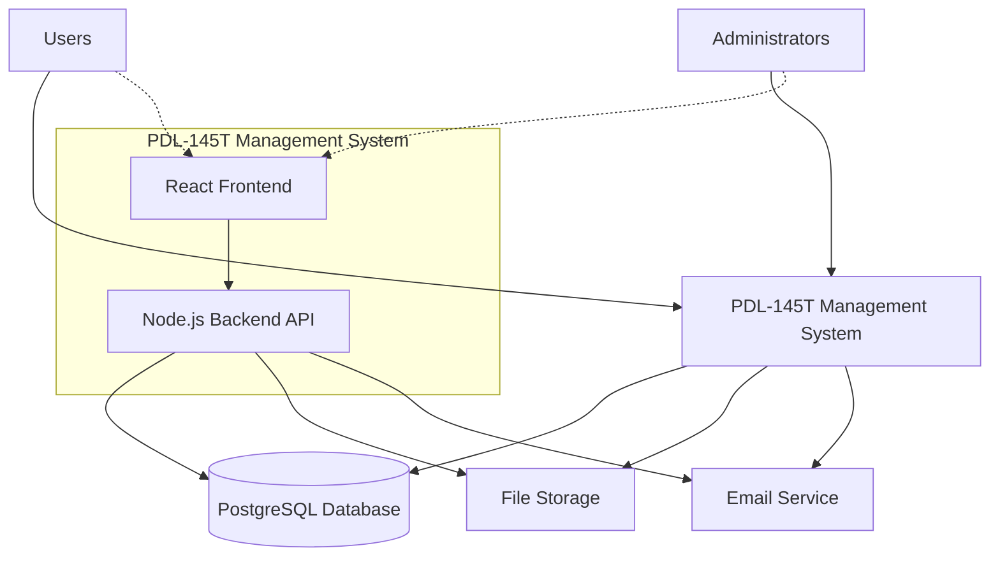

# Architecture Documentation

## Table of Contents

1. [C4 Context Diagram](#c4-context-diagram)
   - [System Context](#system-context)
   - [Key Components](#key-components)
   - [External Dependencies](#external-dependencies)
   - [Technology Stack](#technology-stack)
2. [Architecture Decisions](#architecture-decisions)
3. [Database Schema Overview](#database-schema-overview)
   - [PostgreSQL Physical Schema](#postgresql-physical-schema-pdl_management-database)
   - [Prisma Schema to PostgreSQL Mapping](#prisma-schema-to-postgresql-mapping)
   - [Key PostgreSQL Features Used](#key-postgresql-features-used)
   - [Explanation of Tables and Relationships](#explanation-of-tables-and-relationships)
   - [Benefits of This Schema](#benefits-of-this-schema)
4. [Future Considerations](#future-considerations)
   - [Scalability Targets & Current Foundation](#scalability-targets--current-foundation)
   - [CI/CD Integration Strategy](#cicd-integration-strategy)
   - [Advanced Caching Strategy](#advanced-caching-strategy)
   - [Micro-frontend Evolution Path](#micro-frontend-evolution-path)
   - [Micro-services Architecture Evolution](#micro-services-architecture-evolution)
   - [Event-Driven Architecture Implementation](#event-driven-architecture-implementation)
   - [Technology Migration Strategy](#technology-migration-strategy)
   - [Performance and Monitoring Evolution](#performance-and-monitoring-evolution)
   - [Integration with Present Decisions](#integration-with-present-decisions)
5. [Tool Library](#tool-library)
   - [Gantt Charts](#1-gantt-charts)
   - [Heatmaps](#2-heatmaps)
   - [Timelines](#3-timelines)
6. [Implementation Examples](#implementation-examples)
   - [Microservices Architecture for Horizontal Scaling](#1-microservices-architecture-for-horizontal-scaling)
   - [API Gateway Implementation](#2-api-gateway-implementation)
   - [Event-Driven Architecture for Real-Time Features](#3-event-driven-architecture-for-real-time-features)
   - [Caching Layer Implementation](#4-caching-layer-implementation)
   - [Content Delivery Network (CDN) Integration](#5-content-delivery-network-cdn-integration)
   - [Conclusion](#conclusion)

## C4 Context Diagram



### System Context

The PDL-145T Management System is a comprehensive web application designed to manage PDL-145T operations. It consists of:

- **React Frontend**: User interface for end users and administrators
- **Node.js Backend API**: REST API server handling business logic
- **PostgreSQL Database**: Primary data storage with PostGIS extensions
- **Docker Infrastructure**: Containerized deployment and development environment

### Key Components

1. **Frontend Application (React)**
   - Modern React application with TypeScript
   - Responsive design for desktop and mobile
   - Real-time updates and notifications
   - User authentication and authorization

2. **Backend API (Node.js/Express)**
   - RESTful API endpoints
   - Authentication and authorization middleware
   - Business logic implementation
   - Database integration with Prisma ORM

3. **Database (PostgreSQL)**
   - Structured data storage
   - PostGIS extensions for spatial data
   - Prisma schema management
   - Migration and seeding capabilities

4. **Infrastructure (Docker)**
   - Containerized services
   - Development environment setup
   - Production deployment configuration
   - Service orchestration with Docker Compose

### External Dependencies

- **File Storage**: External file storage service for document management
- **Email Service**: Email notification system for user communications
- **Authentication Provider**: External authentication service (if applicable)

### Technology Stack

- **Frontend**: React, TypeScript, Vite
- **Backend**: Node.js, Express, TypeScript
- **Database**: PostgreSQL with PostGIS
- **ORM**: Prisma
- **Containerization**: Docker, Docker Compose
- **Testing**: Jest, React Testing Library
- **Code Quality**: ESLint, Prettier

## Architecture Decisions

### ADR-001: Technology Stack Selection

- **Status**: Accepted
- **Decision**: Use Node.js/React/PostgreSQL stack
- **Rationale**: Provides full-stack JavaScript development, strong ecosystem, and robust database capabilities

### ADR-002: Containerization Strategy

- **Status**: Accepted
- **Decision**: Use Docker for development and deployment
- **Rationale**: Ensures consistent environments across development, testing, and production

### ADR-003: Database Choice

- **Status**: Accepted
- **Decision**: PostgreSQL with PostGIS extensions
- **Rationale**: Provides strong relational database capabilities with spatial data support

The PDL-145T Management System uses a normalized PostgreSQL database schema (pdl_management) to store
and retrieve data from multiple entities like Projects, Tasks, Expenses, etc. This schema is designed with
relational integrity in mind, ensuring that each entity has its own table, and relationships are properly
defined using Prisma ORM.

### Database Schema Overview

The **pdl_management** PostgreSQL database contains the following main entities:

1. **Project Table**
   - Manages the overall projects with budget and timeline information.

2. **Task Table**
   - Manages individual tasks within a project with completion tracking.

3. **Expense Table**
   - Tracks expenses associated with tasks or projects.

4. **Resource Table**
   - Stores information about available resources for project execution.

5. **Measurement Table**
   - Records site measurements performed by the Construction Execution Agent.

6. **Validation Table**
   - Tracks validations of construction sites by the Construction Execution Agent.

7. **Report Table**
   - Holds reports generated for billing validation by the Finance and Logistics Agent.

8. **User Table**
   - Stores user authentication and profile information with role-based access.

### PostgreSQL Physical Schema (pdl_management database)

```sql
-- Projects Table
CREATE TABLE "Project" (
    "ProjectID" SERIAL PRIMARY KEY,
    "Name" TEXT NOT NULL,
    "StartDate" TIMESTAMPTZ NOT NULL,
    "EndDate" TIMESTAMPTZ,
    "TotalBudget" DECIMAL(65,30) NOT NULL,
    "CreatedAt" TIMESTAMPTZ NOT NULL DEFAULT CURRENT_TIMESTAMP,
    "UpdatedAt" TIMESTAMPTZ NOT NULL DEFAULT CURRENT_TIMESTAMP
);

-- Tasks Table
CREATE TABLE "Task" (
    "TaskID" SERIAL PRIMARY KEY,
    "ProjectID" INTEGER NOT NULL,
    "Description" TEXT,
    "Duration" INTEGER,
    "AssignedTo" TEXT,
    "CompletionStatus" "TaskCompletionStatus" NOT NULL DEFAULT 'NotStarted',
    "CreatedAt" TIMESTAMPTZ NOT NULL DEFAULT CURRENT_TIMESTAMP,
    "UpdatedAt" TIMESTAMPTZ NOT NULL DEFAULT CURRENT_TIMESTAMP,
    CONSTRAINT "Task_ProjectID_fkey" FOREIGN KEY ("ProjectID") REFERENCES "Project"("ProjectID")
        ON DELETE RESTRICT ON UPDATE CASCADE
);

-- Expenses Table
CREATE TABLE "Expense" (
    "ExpenseID" SERIAL PRIMARY KEY,
    "TaskID" INTEGER NOT NULL,
    "Description" TEXT,
    "Cost" DECIMAL(65,30) NOT NULL,
    "Date" TIMESTAMPTZ NOT NULL,
    "CreatedAt" TIMESTAMPTZ NOT NULL DEFAULT CURRENT_TIMESTAMP,
    "UpdatedAt" TIMESTAMPTZ NOT NULL DEFAULT CURRENT_TIMESTAMP,
    CONSTRAINT "Expense_TaskID_fkey" FOREIGN KEY ("TaskID") REFERENCES "Task"("TaskID") ON DELETE RESTRICT ON UPDATE CASCADE
);

-- Resources Table
CREATE TABLE "Resource" (
    "ResourceID" SERIAL PRIMARY KEY,
    "Type" TEXT NOT NULL,
    "Quantity" DECIMAL(65,30) NOT NULL,
    "CreatedAt" TIMESTAMPTZ NOT NULL DEFAULT CURRENT_TIMESTAMP,
    "UpdatedAt" TIMESTAMPTZ NOT NULL DEFAULT CURRENT_TIMESTAMP
);

-- Project Resources Table (Many-to-Many Relationship)
CREATE TABLE "ProjectResource" (
    "ProjectID" INTEGER NOT NULL,
    "ResourceID" INTEGER NOT NULL,
    PRIMARY KEY ("ProjectID", "ResourceID"),
    CONSTRAINT "ProjectResource_ProjectID_fkey" FOREIGN KEY ("ProjectID") REFERENCES "Project"("ProjectID")
        ON DELETE RESTRICT ON UPDATE CASCADE,
    CONSTRAINT "ProjectResource_ResourceID_fkey" FOREIGN KEY ("ResourceID") REFERENCES "Resource"("ResourceID")
        ON DELETE RESTRICT ON UPDATE CASCADE
);

-- Task Resources Table (Many-to-Many Relationship)
CREATE TABLE "TaskResource" (
    "TaskID" INTEGER NOT NULL,
    "ResourceID" INTEGER NOT NULL,
    PRIMARY KEY ("TaskID", "ResourceID"),
    CONSTRAINT "TaskResource_TaskID_fkey" FOREIGN KEY ("TaskID") REFERENCES "Task"("TaskID")
        ON DELETE RESTRICT ON UPDATE CASCADE,
    CONSTRAINT "TaskResource_ResourceID_fkey" FOREIGN KEY ("ResourceID") REFERENCES "Resource"("ResourceID")
        ON DELETE RESTRICT ON UPDATE CASCADE
);

-- Measurements Table
CREATE TABLE "Measurement" (
    "MeasurementID" SERIAL PRIMARY KEY,
    "TaskID" INTEGER NOT NULL,
    "SiteID" TEXT NOT NULL,
    "MeasurementType" TEXT NOT NULL,
    "Value" DECIMAL(65,30) NOT NULL,
    "Date" TIMESTAMPTZ NOT NULL,
    "CreatedAt" TIMESTAMPTZ NOT NULL DEFAULT CURRENT_TIMESTAMP,
    "UpdatedAt" TIMESTAMPTZ NOT NULL DEFAULT CURRENT_TIMESTAMP,
    CONSTRAINT "Measurement_TaskID_fkey" FOREIGN KEY ("TaskID") REFERENCES "Task"("TaskID")
        ON DELETE RESTRICT ON UPDATE CASCADE
);

-- Validations Table
CREATE TABLE "Validation" (
    "ValidationID" SERIAL PRIMARY KEY,
    "TaskID" INTEGER NOT NULL,
    "SiteID" TEXT NOT NULL,
    "Status" "ValidationStatus" NOT NULL DEFAULT 'Pending',
    "Notes" TEXT,
    "GeneratedBy" TEXT NOT NULL,
    "Timestamp" TIMESTAMPTZ NOT NULL DEFAULT CURRENT_TIMESTAMP,
    "UpdatedAt" TIMESTAMPTZ NOT NULL DEFAULT CURRENT_TIMESTAMP,
    CONSTRAINT "Validation_TaskID_fkey" FOREIGN KEY ("TaskID") REFERENCES "Task"("TaskID") ON DELETE RESTRICT ON UPDATE CASCADE
);

-- Reports Table
CREATE TABLE "Report" (
    "ReportID" SERIAL PRIMARY KEY,
    "ValidationID" INTEGER NOT NULL,
    "ProjectID" INTEGER NOT NULL,
    "GeneratedBy" TEXT NOT NULL,
    "Timestamp" TIMESTAMPTZ NOT NULL DEFAULT CURRENT_TIMESTAMP,
    "UpdatedAt" TIMESTAMPTZ NOT NULL DEFAULT CURRENT_TIMESTAMP,
    CONSTRAINT "Report_ValidationID_fkey" FOREIGN KEY ("ValidationID") REFERENCES "Validation"("ValidationID")
        ON DELETE RESTRICT ON UPDATE CASCADE,
    CONSTRAINT "Report_ProjectID_fkey" FOREIGN KEY ("ProjectID") REFERENCES "Project"("ProjectID")
        ON DELETE RESTRICT ON UPDATE CASCADE
);

-- Users Table
CREATE TABLE "User" (
    "id" SERIAL PRIMARY KEY,
    "name" TEXT NOT NULL,
    "email" TEXT NOT NULL UNIQUE,
    "passwordHash" TEXT NOT NULL,
    "role" "UserRole" NOT NULL DEFAULT 'USER',
    "createdAt" TIMESTAMPTZ NOT NULL DEFAULT CURRENT_TIMESTAMP,
    "updatedAt" TIMESTAMPTZ NOT NULL DEFAULT CURRENT_TIMESTAMP
);

-- Enums
CREATE TYPE "TaskCompletionStatus" AS ENUM ('NotStarted', 'InProgress', 'Completed');
CREATE TYPE "ValidationStatus" AS ENUM ('Pending', 'Approved', 'Rejected');
CREATE TYPE "UserRole" AS ENUM ('USER', 'ADMIN', 'SUPERVISOR', 'FINANCE', 'CONSTRUCTION');
```

### Prisma Schema to PostgreSQL Mapping

The Prisma schema maps to the physical PostgreSQL database (pdl_management) as follows:

| **Prisma Type**                     | **PostgreSQL Type**                              | **Description**                  |
| ----------------------------------- | ------------------------------------------------ | -------------------------------- |
| `Int @id @default(autoincrement())` | `SERIAL PRIMARY KEY`                             | Auto-incrementing primary key    |
| `String`                            | `TEXT`                                           | Variable-length text             |
| `String?`                           | `TEXT`                                           | Nullable text field              |
| `DateTime`                          | `TIMESTAMPTZ`                                    | Timestamp with timezone          |
| `DateTime?`                         | `TIMESTAMPTZ`                                    | Nullable timestamp with timezone |
| `DateTime @default(now())`          | `TIMESTAMPTZ NOT NULL DEFAULT CURRENT_TIMESTAMP` | Auto-generated timestamp         |
| `DateTime @updatedAt`               | `TIMESTAMPTZ NOT NULL DEFAULT CURRENT_TIMESTAMP` | Auto-updated timestamp           |
| `Decimal`                           | `DECIMAL(65,30)`                                 | High-precision decimal numbers   |
| `Boolean`                           | `BOOLEAN`                                        | True/false values                |
| `@unique`                           | `UNIQUE`                                         | Unique constraint                |
| `@@id([field1, field2])`            | `PRIMARY KEY ("field1", "field2")`               | Composite primary key            |
| `enum`                              | `CREATE TYPE ... AS ENUM`                        | Custom enumeration types         |
| `@relation`                         | `FOREIGN KEY ... REFERENCES`                     | Foreign key relationships        |

### Key PostgreSQL Features Used

1. **SERIAL**: Auto-incrementing integer primary keys (equivalent to AUTO_INCREMENT in MySQL)
2. **TIMESTAMPTZ**: Timestamp with timezone support for accurate time tracking
3. **BOOLEAN**: Native boolean data type for true/false values
4. **Custom ENUMs**: Type-safe enumeration values for status fields
5. **Foreign Key Constraints**: Referential integrity with CASCADE options
6. **Text Type**: Variable-length text without length limits

### Explanation of Tables and Relationships

1. **Projects**: Manages the overall projects, including their start date, end date, and total budget.
2. **Tasks**: Stores tasks within a project, linked to a specific project via `ProjectID`.
3. **Expenses**: Tracks expenses associated with each task, linked to a specific task via `TaskID`.
4. **Resources**: Stores available resources that can be allocated to projects or tasks.
5. **ProjectResources and TaskResources**: Many-to-many relationships between Projects and Resources,
   as well as Tasks and Resources, allowing flexibility in resource allocation.
6. **Measurements**: Records site measurements performed by the Construction Execution Agent,
   linked to a specific task via `TaskID`.
7. **Validations**: Tracks validations of construction sites by the Construction Execution Agent,
   linked to a specific task via `TaskID`.
8. **Reports**: Holds reports generated for billing validation by the Finance and Logistics Agent,
   linked to a specific validation via `ValidationID`.

### Benefits of This Schema

- **Normalization**: Ensures data integrity and minimizes redundancy.
- **Flexibility**: Allows for easy addition of new entities or attributes without breaking existing relationships.
- **Scalability**: Suitable for growing projects with increasing tasks, expenses, and resources.

This schema can be further customized based on specific requirements, such as adding more detailed
fields, additional tables, or complex queries to support advanced reporting and analysis.

## Future Considerations

### Scalability Targets & Current Foundation

**Short-term (6-12 months):**

- **User Load Target**: 100-500 concurrent users
- **Data Volume**: 10,000+ projects, 100,000+ tasks
- **Response Time**: <200ms for API calls, <1s for complex queries
- **Current Foundation**: npm workspaces monorepo provides clear separation that can scale independently
- **Database Scaling**: PostgreSQL with read replicas, leveraging our existing Prisma ORM for connection pooling

**Medium-term (1-2 years):**

- **User Load Target**: 1,000-5,000 concurrent users across multiple regions
- **Data Volume**: 100,000+ projects, 1M+ tasks, spatial data growth
- **Geographic Distribution**: Multi-region deployment capability
- **Current Foundation**: Docker containerization enables horizontal scaling and multi-region deployment

**Long-term (2-5 years):**

- **User Load Target**: 10,000+ concurrent users, enterprise-grade deployment
- **Data Volume**: 1M+ projects, 10M+ tasks, extensive reporting and analytics
- **Advanced Features**: Real-time collaboration, advanced analytics, AI-powered insights
- **Current Foundation**: Clear workspace boundaries in our monorepo facilitate future microservices extraction

### CI/CD Integration Strategy

#### Phase 1: Foundation (Immediate)

- **GitHub Actions Pipeline**: Leverage our existing npm workspaces structure for parallel builds
- **Workspace-based Testing**: `npm run test --workspaces` enables concurrent testing
- **Docker Integration**: Build on our existing Docker Compose setup for consistent environments
- **Database Migrations**: Automate Prisma migrations with our current schema management

```yaml
# .github/workflows/ci.yml (proposed)
name: CI/CD Pipeline
strategy:
  matrix:
    workspace: [backend, frontend]
steps:
  - run: npm run build --workspace=${{ matrix.workspace }}
  - run: npm run test --workspace=${{ matrix.workspace }}
  - run: npm run lint --workspace=${{ matrix.workspace }}
```

#### Phase 2: Advanced Deployment (3-6 months)

- **Environment Promotion**: Dev → Staging → Production using our Docker containers
- **Database Migration Strategy**: Automated Prisma migrations with rollback capabilities
- **Feature Flags**: Gradual rollout leveraging our React frontend architecture
- **Performance Monitoring**: Integration with our PostgreSQL monitoring

#### Phase 3: Advanced CI/CD (6-12 months)

- **Workspace-specific Deployments**: Deploy backend and frontend independently
- **Database Versioning**: Advanced schema versioning with our Prisma setup
- **Security Scanning**: Container and dependency scanning in our Docker workflow
- **Automated Performance Testing**: Load testing against our PostgreSQL database

### Advanced Caching Strategy

**Current State Integration**:

- **Application Layer**: Redis integration with our existing Docker Compose setup
- **Database Layer**: PostgreSQL query result caching with our Prisma ORM
- **Frontend Layer**: Browser caching for our React application

**Proposed Implementation**:

```yaml
# infrastructure/docker-compose.yml (enhancement)
services:
  redis:
    image: redis:7-alpine
    ports: ['6379:6379']
    volumes: [redis_data:/data]
    command: redis-server --appendonly yes

  backend:
    environment:
      - REDIS_URL=redis://redis:6379
      - DATABASE_URL=postgresql://user:pass@db:5432/pdl_management
```

**Caching Layers**:

1. **API Response Caching**: Redis-based caching for frequently accessed project data
2. **Database Query Caching**: Prisma query result caching for complex reports
3. **Session Caching**: User session and authentication data in Redis
4. **CDN Caching**: Static assets from our React build process

### Micro-frontend Evolution Path

**Current Foundation**: Our npm workspaces frontend provides a solid base for micro-frontend architecture

#### Phase 1: Module Federation (6-12 months)

```javascript
// frontend/vite.config.ts (future enhancement)
export default defineConfig({
  plugins: [
    react(),
    federation({
      name: 'host',
      remotes: {
        projectManagement: 'http://localhost:3001/assets/remoteEntry.js',
        taskManagement: 'http://localhost:3002/assets/remoteEntry.js',
        reporting: 'http://localhost:3003/assets/remoteEntry.js',
      },
    }),
  ],
});
```

#### Phase 2: Independent Micro-frontends (12-24 months)

- **Project Management Module**: Extracted from current frontend workspace
- **Task Management Module**: Separate deployment and development cycle
- **Reporting Module**: Advanced analytics and visualization components
- **Shared Component Library**: Common UI components and design system

### Micro-services Architecture Evolution

**Current Monorepo Advantage**: Our npm workspaces structure already defines clear service boundaries

#### Phase 1: Service Extraction (12-18 months)

```text
Current:  backend/ → Future: Multiple services
├── project-service/     # Project management logic
├── task-service/        # Task operations and workflows
├── user-service/        # Authentication and user management
├── reporting-service/   # Analytics and report generation
└── shared-library/      # Common utilities and types
```

#### Phase 2: Service Mesh Implementation (18-36 months)

- **API Gateway**: Route requests to appropriate services
- **Service Discovery**: Dynamic service location and health checking
- **Circuit Breaker**: Fault tolerance between services
- **Distributed Tracing**: Monitor requests across service boundaries

**Database Strategy for Microservices**:

- **Current**: Single PostgreSQL database with clear schema boundaries
- **Future**: Database per service with our existing Prisma schemas as the foundation
- **Migration Path**: Gradual data extraction using our current schema structure

### Event-Driven Architecture Implementation

**Foundation**: Build on our existing Docker Compose infrastructure

```yaml
# infrastructure/docker-compose.yml (future enhancement)
services:
  kafka:
    image: confluentinc/cp-kafka:latest
    environment:
      KAFKA_ZOOKEEPER_CONNECT: zookeeper:2181
      KAFKA_ADVERTISED_LISTENERS: PLAINTEXT://kafka:9092

  backend:
    environment:
      - KAFKA_BROKERS=kafka:9092
      - DATABASE_URL=postgresql://user:pass@db:5432/pdl_management
```

**Event Types**:

- **Project Events**: Project created, updated, completed
- **Task Events**: Task assigned, status changed, completed
- **User Events**: User login, role changes, activity tracking
- **Integration Events**: External system synchronization

### Technology Migration Strategy

**Current Technology Investment Protection**:

- **npm Workspaces**: Foundation for both monorepo and microservices approaches
- **Docker Containers**: Enables both current monolith and future microservices
- **PostgreSQL + Prisma**: Scales from single database to distributed data architecture
- **React Frontend**: Supports both monolithic and micro-frontend patterns

**Migration Principles**:

1. **Incremental Evolution**: Each phase builds on current architecture decisions
2. **Backward Compatibility**: Maintain existing functionality during transitions
3. **Risk Mitigation**: Gradual rollout with rollback capabilities
4. **Team Readiness**: Align architectural evolution with team growth and capabilities

### Performance and Monitoring Evolution

**Current Foundation**: Docker Compose health checks and PostgreSQL monitoring

**Enhanced Monitoring Stack**:

- **Application Monitoring**: APM integration with our Node.js backend
- **Database Monitoring**: PostgreSQL performance metrics and query analysis
- **Container Monitoring**: Docker container resource usage and health
- **User Experience Monitoring**: React application performance and user interaction tracking

### Integration with Present Decisions

**How Current Architecture Enables Future Evolution**:

1. **npm Workspaces** → **Microservices**: Clear service boundaries already defined
2. **Docker Compose** → **Kubernetes**: Container-first approach scales naturally
3. **PostgreSQL + Prisma** → **Distributed Data**: Schema-first approach enables data migration
4. **React Frontend** → **Micro-frontends**: Component-based architecture supports modularization
5. **TypeScript** → **Cross-service Communication**: Strong typing enables distributed system contracts

**Risk Mitigation Strategy**:

- **Gradual Migration**: Each evolution phase maintains backward compatibility
- **Feature Flags**: New architecture patterns introduced incrementally
- **A/B Testing**: Compare performance between monolithic and distributed approaches
- **Rollback Plans**: Maintain ability to revert to previous architectural patterns

This future-considerations roadmap ensures our current architectural decisions provide a solid
foundation for scaling to enterprise-level requirements while maintaining development velocity
and system reliability.

## Tool Library

### 1. **Gantt Charts**

- **Highcharts**: A widely used JavaScript library for creating high-performance charts and graphs, including Gantt charts.
  - Website: [https://www.highcharts.com/gantt/](https://www.highcharts.com/gantt/)
  - Example:

    ```javascript
    Highcharts.ganttChart('container', {
      series: [
        {
          name: 'Project milestones',
          data: [
            { name: 'Task #1', start: Date.UTC(2023, 5, 1), end: Date.UTC(2023, 5, 5) },
            { name: 'Task #2', start: Date.UTC(2023, 5, 6), end: Date.UTC(2023, 5, 10) },
          ],
        },
      ],
    });
    ```

- **FullCalendar**: A JavaScript library that renders calendar views (like Gantt charts) and provides
  a flexible interface for event management.
  - Website: [https://fullcalendar.io/](https://fullcalendar.io/)
  - Example:

    ```javascript
    document.addEventListener('DOMContentLoaded', function () {
      var calendarEl = document.getElementById('calendar');
      var calendar = new FullCalendar.Calendar(calendarEl, {
        initialView: 'timeline',
        timeZone: 'UTC',
        events: [
          { title: 'Task #1', start: '2023-06-01T08:00:00Z', end: '2023-06-05T17:00:00Z' },
          { title: 'Task #2', start: '2023-06-06T09:00:00Z', end: '2023-06-10T18:00:00Z' },
        ],
      });
      calendar.render();
    });
    ```

### 2. **Heatmaps**

- **Leaflet Heatmap Plugin**: A plugin for Leaflet.js that allows you to create heatmaps on maps,
  useful for visualizing density data.
  - Website: [https://leaflet.github.io/heatmaps/](https://leaflet.github.io/heatmaps/)
  - Example:

    ```javascript
    var map = L.map('map').setView([51.505, -0.09], 13);
    L.tileLayer('https://{s}.tile.openstreetmap.org/{z}/{x}/{y}.png', {
      attribution: '© OpenStreetMap contributors',
    }).addTo(map);

    var heatmapData = [
      [51.5, -0.09, 0.8],
      [51.49, -0.06, 0.6],
    ];
    L.heatLayer(heatmapData).addTo(map);
    ```

- **D3.js**: A powerful library for creating interactive data visualizations.
  - Website: [https://d3js.org/](https://d3js.org/)
  - Example:

    ```javascript
    d3.select('body')
      .append('svg')
      .attr('width', width)
      .attr('height', height)
      .selectAll('circle')
      .data(heatmapData)
      .enter()
      .append('circle')
      .attr('cx', function (d) {
        return x(d[0]);
      })
      .attr('cy', function (d) {
        return y(d[1]);
      })
      .attr('r', function (d) {
        return Math.sqrt(d[2]) * 5;
      });
    ```

### 3. **Timelines**

- **D3.js**: As mentioned earlier, D3.js is excellent for creating complex and interactive timelines.
  - Website: [https://d3js.org/](https://d3js.org/)
  - Example:

    ```javascript
    d3.select('body')
      .append('svg')
      .attr('width', width)
      .attr('height', height)
      .selectAll('rect')
      .data(timelineData)
      .enter()
      .append('rect')
      .attr('x', function (d) {
        return x(d.start);
      })
      .attr('y', function (d, i) {
        return y(i);
      })
      .attr('width', function (d) {
        return x(d.end) - x(d.start);
      })
      .attr('height', height / timelineData.length)
      .style('fill', 'steelblue');
    ```

- **TimelineJS**: A tool for creating engaging timelines with multimedia content.
  - Website: [https://timeline.knightlab.com/](https://timeline.knightlab.com/)
  - Example:

    ```html
    <script src="https://cdn.knightlab.com/libs/timeline3/latest/js/timeline-min.js"></script>
    <div id="timeline-embed"></div>
    <script type="text/javascript">
      var data = {
        events: [
          {
            start_date: { year: 2010 },
            end_date: { year: 2011 },
            text: { headline: 'Event 1', text: 'Description of Event 1.' },
          },
          {
            start_date: { year: 2012 },
            end_date: { year: 2013 },
            text: { headline: 'Event 2', text: 'Description of Event 2.' },
          },
        ],
      };
      var timeline = new TL.Timeline('timeline-embed', data);
    </script>
    ```

These tools and libraries provide a robust foundation for creating interactive reports. Depending on
your specific requirements, you might need to combine multiple tools or customize them further to
achieve the desired visualizations.

## Implementation Examples

To implement the mentioned requirements in a microservices architecture, follow these steps:

### 1. **Microservices Architecture for Horizontal Scaling**

#### Define Services

Start by defining your services based on bounded contexts and business capabilities. For example:

- User Management Service
- Order Processing Service
- Payment Gateway Service

#### Use Containerization (Docker)

Containerize each service to ensure they are portable and isolated from the environment.

```dockerfile
# Example Dockerfile for a user management service
FROM node:14
WORKDIR /app
COPY package*.json ./
RUN npm install
COPY . .
CMD ["node", "server.js"]
```

#### Use Orchestration (Kubernetes)

Set up Kubernetes to manage your containerized services. This will enable you to scale horizontally
by adding more replicas of each service.

```yaml
# Example Kubernetes deployment for a user management service
apiVersion: apps/v1
kind: Deployment
metadata:
  name: user-management-service
spec:
  replicas: 3
  selector:
    matchLabels:
      app: user-management
  template:
    metadata:
      labels:
        app: user-management
    spec:
      containers:
        - name: user-management
          image: your-docker-registry/user-management-service:latest
          ports:
            - containerPort: 3000
```

### 2. **API Gateway Implementation**

#### Use an API Gateway (e.g., AWS API Gateway, NGINX)

The API gateway acts as a single entry point for clients to access multiple microservices.

**Using AWS API Gateway:**

- Create a REST API.
- Define methods (GET, POST, PUT, DELETE) and routes that map to your microservices.

**Using NGINX:**

- Configure NGINX as an reverse proxy.
- Use routing rules based on the request path to direct traffic to appropriate services.

```nginx
http {
    upstream user_management_service {
        server user-management-service:3000;
    }
    upstream order_processing_service {
        server order-processing-service:3000;
    }

    server {
        listen 80;

        location /user {
            proxy_pass http://user_management_service;
        }

        location /order {
            proxy_pass http://order_processing_service;
        }
    }
}
```

### 3. **Event-Driven Architecture for Real-Time Features**

#### Use an Event Bus (e.g., AWS EventBridge, Kafka)

An event bus facilitates communication between microservices by publishing and subscribing to events.

**Using AWS EventBridge:**

- Create custom events.
- Configure rules that trigger the appropriate services based on events.

**Using Apache Kafka:**

- Set up a Kafka cluster.
- Produce events from one service.
- Consume events in another service.

```java
// Example using AWS SDK for Java
import software.amazon.awssdk.services.eventbridge.EventBridgeClient;
import software.amazon.awssdk.services.eventbridge.model.PutEventsRequest;
import software.amazon.awssdk.services.eventbridge.model.PutEventsRequestEntry;

EventBridgeClient eventBridgeClient = EventBridgeClient.create();
PutEventsRequestEntry entry = PutEventsRequestEntry.builder()
    .detailType("UserCreated")
    .source("user.management")
    .resources(Arrays.asList("arn:aws:sns:us-west-2:123456789012:user-created"))
    .build();

List<PutEventsRequestEntry> entries = Arrays.asList(entry);
PutEventsRequest request = PutEventsRequest.builder().entries(entries).build();
eventBridgeClient.putEvents(request);
```

### 4. **Caching Layer Implementation**

#### Use a Caching Service (e.g., Redis, Memcached)

A caching layer can significantly improve performance by reducing the need to fetch data from slower storage solutions.

**Using Redis:**

- Install and configure Redis.
- Use Redis as an in-memory cache for frequently accessed data.

```python
# Example using Redis with Python
import redis

cache = redis.Redis(host='localhost', port=6379, db=0)

def get_user(user_id):
    user_data = cache.get(f'user:{user_id}')
    if not user_data:
        # Fetch user data from database and store in cache
        user_data = fetch_user_from_database(user_id)
        cache.setex(f'user:{user_id}', 3600, user_data)  # Cache for 1 hour
    return user_data
```

### 5. **Content Delivery Network (CDN) Integration**

#### Use a CDN Service (e.g., AWS CloudFront, Akamai)

A CDN can reduce latency and improve the performance of your application by serving static content
from locations closer to the end-users.

**Using AWS CloudFront:**

- Create a CloudFront distribution.
- Configure it to use your origin server (e.g., an S3 bucket or EC2 instance).

```yaml
# Example CloudFormation template for an S3-backed CloudFront distribution
Resources:
  MyDistribution:
    Type: 'AWS::CloudFront::Distribution'
    Properties:
      DistributionConfig:
        Aliases:
          - www.example.com
        DefaultCacheBehavior:
          AllowedMethods:
            - GET
            - HEAD
            - OPTIONS
          CachedMethods:
            - GET
            - HEAD
          Compress: true
          DefaultRootObject: index.html
          ForwardedValues:
            Cookies:
              Forward: none
            Headers:
              Quantity: 0
            QueryString: false
          MaxTTL: '86400'
          MinTTL: '300'
          TargetOriginId: MyS3Bucket
          ViewerProtocolPolicy: redirect-to-https
        Enabled: true
        HttpVersion: http2
        IPV6Enabled: true
        LoggingConfig:
          Bucket: my-cloudfront-logs.s3.amazonaws.com
          Enabled: true
          Prefix: mydistribution/
        OriginGroups:
          Quantity: 1
          OriginGroupList:
            - Id: MyOriginGroup
              Members:
                - Id: MyS3Origin
                  S3OriginConfig:
                    DomainName: mybucket.s3.amazonaws.com
                    OriginPath: ''
                    OriginSSLProtocols:
                      Quantity: 2
                      Items:
                        - TLSv1.2
                        - TLSv1.3
              FailoverCriteria:
                StatusCodes:
                  Quantity: 2
                  Items:
                    - 504
                    - 502
              Weight: 1
        Origins:
          Quantity: 1
          OriginList:
            - DomainName: mybucket.s3.amazonaws.com
              Id: MyS3Origin
              S3OriginConfig:
                OriginPath: ''
                OriginSSLProtocols:
                  Quantity: 2
                  Items:
                    - TLSv1.2
                    - TLSv1.3
        PriceClass: PriceClass_All
        WebACLId: ''
```

### Conclusion

Implementing a microservices architecture with the specified requirements will help you achieve
horizontal scaling, real-time features, caching, and content delivery. By following these steps and
using the appropriate tools and libraries, you can build a scalable and performant system that meets
the needs of your application.
